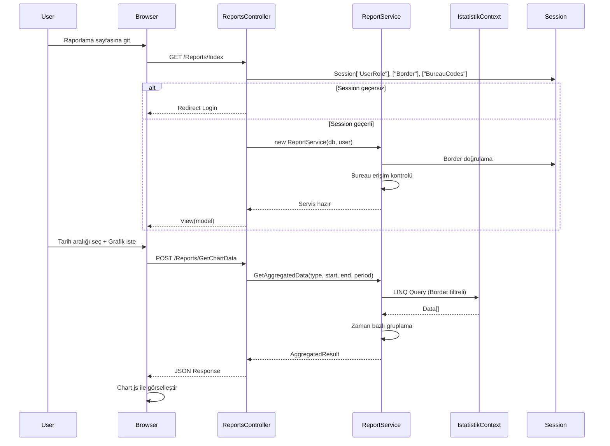

# Tasarım Belgesi - İstatistik Raporlama ve Görselleştirme Sayfası

## Genel Bakış

Bu belge, havalimanı emniyet birimleri için istatistik raporlama ve görselleştirme sisteminin teknik tasarımını tanımlar. Sistem, mevcut PassportController ve PassportService desenine uygun olarak geliştirilecek ve kullanıcıların rol ve büro yetkilerine göre istatistikleri grafik ve tablo formatında görüntülemesini, zaman aralığı filtreleme yapmasını ve dönemsel karşılaştırmalar gerçekleştirmesini sağlayacaktır.

### Temel Prensipler

1. **Border Güvenliği**: Tüm sorgularda `Border` değeri mutlaka `Session["Border"]` oturumundan alınır, istemciden gelen `Border` parametresi asla kabul edilmez.
2. **Rol Bazlı Yetkilendirme**: `RoleAuthorize` filtresi ve `CanAccessBureau` kontrolü ile büro erişim yetkisi sağlanır.
3. **PassportController Deseni**: Controller yapısı mevcut `PassportController`'ı model alacak; tüm işlemler `ReportService` üzerinden `Run(...)` helper metodu ile sarmalanacak.
4. **Oturum Yönetimi**: Anti-forgery token, Session kontrolü ve FormsAuthentication kullanılır.
5. **Frontend Teknolojileri**: Bootstrap 5, Vanilla JavaScript (jQuery yok), Chart.js (CDN).

## Mimari

### Katman Yapısı

```
┌─────────────────────────────────────────────────────────┐
│                    Presentation Layer                    │
│  ┌──────────────────────────────────────────────────┐  │
│  │  ReportsController                               │  │
│  │  - RoleAuthorize Attribute                       │  │
│  │  - Run() Helper Method                           │  │
│  │  - Anti-Forgery Token Validation                 │  │
│  └──────────────────────────────────────────────────┘  │
│  ┌──────────────────────────────────────────────────┐  │
│  │  Views/Reports/Index.cshtml                      │  │
│  │  - Bootstrap 5 Responsive Layout                 │  │
│  │  - Sekmeli Yapı (Grafik, Tablo, Karşılaştırma)  │  │
│  │  - Vanilla JavaScript Modules                    │  │
│  └──────────────────────────────────────────────────┘  │
└─────────────────────────────────────────────────────────┘
                            │
                            ▼
┌─────────────────────────────────────────────────────────┐
│                     Service Layer                        │
│  ┌──────────────────────────────────────────────────┐  │
│  │  ReportService                                   │  │
│  │  - Constructor(db, user)                         │  │
│  │  - Border Validation & Locking                   │  │
│  │  - Bureau Permission Check                       │  │
│  │  - Time-based Aggregation Methods               │  │
│  │  - Comparison Methods                            │  │
│  │  - Export Methods (CSV, Excel)                   │  │
│  └──────────────────────────────────────────────────┘  │
└─────────────────────────────────────────────────────────┘
                            │
                            ▼
┌─────────────────────────────────────────────────────────┐
│                      Data Layer                          │
│  ┌──────────────────────────────────────────────────┐  │
│  │  IstatistikContext (EF6)                         │  │
│  │  - YolcuUcakIstatistikleri                       │  │
│  │  - GunlukZamanSerisiYolcular                     │  │
│  │  - InadYolcular                                  │  │
│  │  - TahditKayitlari                               │  │
│  │  - HaftalikOlayCizelgeleri                       │  │
│  │  - Bureaus, UserAssignments, UserBureaus         │  │
│  └──────────────────────────────────────────────────┘  │
└─────────────────────────────────────────────────────────┘
```

### Veri Akış Diyagramı



## Bileşenler ve Arayüzler

### 1. ReportsController

**Dosya Yolu**: `Controllers/ReportsController.cs`

**Sorumluluklar**:
- Kullanıcı oturum kontrolü ve yetkilendirme
- HTTP isteklerini karşılama ve ReportService'e yönlendirme
- Hata yönetimi ve JSON response üretimi
- Anti-forgery token doğrulama

**Metotlar**:

```csharp
[RoleAuthorize(AppRoles.SuperAdmin, AppRoles.UnitAdmin, AppRoles.BureauUser)]
public class ReportsController : Controller
{
    private readonly IstatistikContext _db;

    // PassportController desenine uygun Run helper metodu
    private ActionResult Run(Func<ReportService, object> action, bool allowGet = true)
    
    // Ana sayfa
    [HttpGet]
    public ActionResult Index()
    
    // Zaman serisi verilerini döndürür
    [HttpPost]
    [ValidateAntiForgeryToken]
    public ActionResult GetChartData(string dataType, DateTime startDate, DateTime endDate, string periodType)
    
    // Tablo verilerini döndürür
    [HttpPost]
    [ValidateAntiForgeryToken]
    public ActionResult GetTableData(string dataType, DateTime startDate, DateTime endDate, string periodType, int page = 1, int pageSize = 25, string sortBy = null, bool sortDesc = false)
    
    // Karşılaştırma verilerini döndürür
    [HttpPost]
    [ValidateAntiForgeryToken]
    public ActionResult GetComparisonData(string dataType, DateTime period1Start, DateTime period1End, DateTime period2Start, DateTime period2End, string periodType)
    
    // CSV export
    [HttpPost]
    [ValidateAntiForgeryToken]
    public ActionResult ExportCsv(string dataType, DateTime startDate, DateTime endDate, string periodType)
    
    // Excel export (EPPlus)
    [HttpPost]
    [ValidateAntiForgeryToken]
    public ActionResult ExportExcel(string dataType, DateTime startDate, DateTime endDate, string periodType)
}
```

**Endpoint Örnekleri**:
- `GET /Reports/Index` → Ana raporlama sayfası
- `POST /Reports/GetChartData` → Grafik verileri (JSON)
- `POST /Reports/GetTableData` → Tablo verileri (JSON)
- `POST /Reports/GetComparisonData` → Karşılaştırma verileri (JSON)
- `POST /Reports/ExportCsv` → CSV dosyası (FileResult)
- `POST /Reports/ExportExcel` → Excel dosyası (FileResult)

### 2. ReportService

**Dosya Yolu**: `Services/ReportService.cs`

**Sorumluluklar**:
- Border ve Bureau yetki kontrolü
- Zaman bazlı veri toplama (günlük, haftalık, aylık, yıllık)
- Dönemsel karşılaştırma hesaplamaları
- İstatistiksel hesaplamalar (toplam, ortalama, maksimum)
- CSV ve Excel export işlemleri

**Ana Sınıf Yapısı**:

```csharp
public class ReportService
{
    private readonly IstatistikContext _db;
    private readonly CurrentUser _user;
    private readonly string _border;
    private readonly List<string> _bureauCodes;

    // PassportService desenine uygun constructor
    public ReportService(IstatistikContext db, CurrentUser user)
    {
        _db = db ?? throw new ArgumentNullException(nameof(db));
        _user = user ?? throw new ArgumentNullException(nameof(user));
        _border = _user.Border;
        
        if (string.IsNullOrWhiteSpace(_border))
            throw new UnauthorizedAccessException("Havalimanı bilginiz tanımlı değil.");
        
        _bureauCodes = _user.BureauCodes ?? new List<string>();
    }

    // Veri türü kontrolü ve yetkilendirme
    private void ValidateDataTypeAccess(string dataType)
    {
        var bureauCode = GetBureauCodeForDataType(dataType);
        if (!_user.CanAccessBureau(bureauCode))
            throw new UnauthorizedAccessException($"{dataType} verileri için yetkiniz yok.");
    }

    // Zaman bazlı toplama
    public AggregatedDataResult GetAggregatedData(string dataType, DateTime startDate, DateTime endDate, PeriodType periodType)
    
    // Karşılaştırma
    public ComparisonResult GetComparisonData(string dataType, DateTime p1Start, DateTime p1End, DateTime p2Start, DateTime p2End, PeriodType periodType)
    
    // Sayfalanmış tablo verileri
    public PagedTableResult GetPagedTableData(string dataType, DateTime startDate, DateTime endDate, PeriodType periodType, int page, int pageSize, string sortBy, bool sortDesc)
    
    // Export metodları
    public byte[] ExportToCsv(AggregatedDataResult data, string fileName)
    public byte[] ExportToExcel(AggregatedDataResult data, string fileName)
}
```

**Desteklenen Veri Türleri**:

| `dataType` | Tablo | Bureau Kodu | Açıklama |
|------------|-------|-------------|----------|
| `yolcuucak` | YolcuUcakIstatistikleri | PASAPORT | Yolcu ve uçak istatistikleri |
| `gunluk` | GunlukZamanSerisiYolcular | PASAPORT | Günlük zaman serisi |
| `inad` | InadYolcular | PASAPORT | İNAD yolcu kayıtları |
| `tahdit` | TahditKayitlari | PASAPORT | Tahdit kayıtları |
| `haftalik` | HaftalikOlayCizelgeleri | PASAPORT | Haftalık olay çizelgesi |

**Zaman Dilimleme Stratejileri**:

```csharp
public enum PeriodType
{
    Daily,      // Günlük: Her gün bir veri noktası
    Weekly,     // Haftalık: Pazartesi başlangıçlı haftalar
    Monthly,    // Aylık: Her takvim ayı
    Yearly      // Yıllık: Her takvim yılı
}

// Günlük toplama
private List<AggregatedDataPoint> AggregateByDay(IQueryable<T> query, DateTime start, DateTime end)
{
    return query
        .GroupBy(x => DbFunctions.TruncateTime(x.Tarih))
        .Select(g => new AggregatedDataPoint
        {
            Date = g.Key.Value,
            Value = g.Sum(x => x.Value)
        })
        .OrderBy(x => x.Date)
        .ToList();
}

// Haftalık toplama (Pazartesi başlangıçlı)
private List<AggregatedDataPoint> AggregateByWeek(IQueryable<T> query, DateTime start, DateTime end)
{
    // ISO 8601 hafta numarası hesaplama
    // Pazartesi = haftanın ilk günü
    return query.ToList()
        .GroupBy(x => GetWeekStartDate(x.Tarih))
        .Select(g => new AggregatedDataPoint
        {
            Date = g.Key,
            Value = g.Sum(x => x.Value)
        })
        .OrderBy(x => x.Date)
        .ToList();
}

// Aylık toplama
private List<AggregatedDataPoint> AggregateByMonth(IQueryable<T> query, DateTime start, DateTime end)
{
    return query
        .GroupBy(x => new { x.Tarih.Year, x.Tarih.Month })
        .Select(g => new AggregatedDataPoint
        {
            Date = new DateTime(g.Key.Year, g.Key.Month, 1),
            Value = g.Sum(x => x.Value)
        })
        .OrderBy(x => x.Date)
        .ToList();
}

// Yıllık toplama
private List<AggregatedDataPoint> AggregateByYear(IQueryable<T> query, DateTime start, DateTime end)
{
    return query
        .GroupBy(x => x.Tarih.Year)
        .Select(g => new AggregatedDataPoint
        {
            Date = new DateTime(g.Key, 1, 1),
            Value = g.Sum(x => x.Value)
        })
        .OrderBy(x => x.Date)
        .ToList();
}
```

### 3. View Katmanı

**Dosya Yolu**: `Views/Reports/Index.cshtml`

**Layout Yapısı**:

```html
@{
    ViewBag.Title = "Raporlama ve Görselleştirme";
    Layout = "~/Views/Shared/_Layout.cshtml";
}

<div class="container-fluid">
    <div class="row">
        <div class="col-12">
            <h2>İstatistik Raporları</h2>
            <p class="text-muted">Havalimanı: <strong>@ViewBag.Border</strong></p>
        </div>
    </div>

    <!-- Filtre Paneli -->
    <div class="row mb-4">
        <div class="col-12">
            <div class="card">
                <div class="card-body">
                    <!-- Veri Türü Seçimi -->
                    <!-- Tarih Aralığı Seçimi -->
                    <!-- Dönem Tipi Seçimi -->
                    <!-- Filtrele Butonu -->
                </div>
            </div>
        </div>
    </div>

    <!-- Sekmeli İçerik -->
    <ul class="nav nav-tabs" id="reportTabs" role="tablist">
        <li class="nav-item">
            <button class="nav-link active" data-bs-toggle="tab" data-bs-target="#chart-tab">Grafik</button>
        </li>
        <li class="nav-item">
            <button class="nav-link" data-bs-toggle="tab" data-bs-target="#table-tab">Tablo</button>
        </li>
        <li class="nav-item">
            <button class="nav-link" data-bs-toggle="tab" data-bs-target="#comparison-tab">Karşılaştırma</button>
        </li>
    </ul>

    <div class="tab-content" id="reportTabsContent">
        <!-- Grafik Sekmesi -->
        <div class="tab-pane fade show active" id="chart-tab">
            <div class="card">
                <div class="card-body">
                    <canvas id="reportChart"></canvas>
                </div>
            </div>
        </div>

        <!-- Tablo Sekmesi -->
        <div class="tab-pane fade" id="table-tab">
            <div class="card">
                <div class="card-body">
                    <table id="reportTable" class="table table-striped">
                        <!-- Dinamik tablo -->
                    </table>
                    <!-- Pagination -->
                </div>
            </div>
        </div>

        <!-- Karşılaştırma Sekmesi -->
        <div class="tab-pane fade" id="comparison-tab">
            <div class="card">
                <div class="card-body">
                    <!-- Dönem seçimleri -->
                    <!-- Karşılaştırma tablosu ve grafik -->
                </div>
            </div>
        </div>
    </div>
</div>

@section Scripts {
    <script src="https://cdn.jsdelivr.net/npm/chart.js@4.4.0/dist/chart.umd.min.js"></script>
    <script src="~/Scripts/reports/chart-module.js"></script>
    <script src="~/Scripts/reports/table-module.js"></script>
    <script src="~/Scripts/reports/comparison-module.js"></script>
    <script src="~/Scripts/reports/main.js"></script>
}
```

### 4. JavaScript Modülleri

**Dosya Yapısı**:
```
Scripts/
  reports/
    main.js              # Ana orkestrasyon
    chart-module.js      # Chart.js entegrasyonu
    table-module.js      # Tablo yönetimi ve sıralama
    comparison-module.js # Karşılaştırma işlemleri
    api-client.js        # AJAX istekleri ve anti-forgery token
```

**chart-module.js**:
```javascript
// Chart.js ile grafik oluşturma ve güncelleme
const ChartModule = (function() {
    let chartInstance = null;
    
    function createChart(canvasId, data, type = 'line') {
        destroyChart();
        const ctx = document.getElementById(canvasId).getContext('2d');
        chartInstance = new Chart(ctx, {
            type: type,
            data: data,
            options: {
                responsive: true,
                maintainAspectRatio: false,
                plugins: {
                    legend: { position: 'top' },
                    tooltip: {
                        callbacks: {
                            title: (items) => formatDate(items[0].label),
                            label: (item) => `${item.dataset.label}: ${formatNumber(item.parsed.y)}`
                        }
                    }
                }
            }
        });
    }
    
    function destroyChart() {
        if (chartInstance) {
            chartInstance.destroy();
            chartInstance = null;
        }
    }
    
    function changeChartType(type) {
        if (!chartInstance) return;
        chartInstance.config.type = type;
        chartInstance.update();
    }
    
    function downloadChart(format) {
        if (!chartInstance) return;
        const url = format === 'png' 
            ? chartInstance.toBase64Image('image/png', 1.0)
            : chartInstance.toBase64Image('image/jpeg', 0.9);
        
        const link = document.createElement('a');
        link.download = `rapor-${Date.now()}.${format}`;
        link.href = url;
        link.click();
    }
    
    return {
        create: createChart,
        destroy: destroyChart,
        changeType: changeChartType,
        download: downloadChart
    };
})();
```

**table-module.js**:
```javascript
// Tablo oluşturma, sıralama ve pagination
const TableModule = (function() {
    let currentData = [];
    let currentSort = { column: null, desc: false };
    
    function renderTable(containerId, data, columns) {
        currentData = data;
        const container = document.getElementById(containerId);
        
        let html = '<table class="table table-striped table-hover">';
        html += '<thead><tr>';
        columns.forEach(col => {
            const sortIcon = getSortIcon(col.key);
            html += `<th data-sort="${col.key}" style="cursor:pointer">${col.label} ${sortIcon}</th>`;
        });
        html += '</tr></thead><tbody>';
        
        data.forEach(row => {
            html += '<tr>';
            columns.forEach(col => {
                html += `<td>${formatCellValue(row[col.key], col.type)}</td>`;
            });
            html += '</tr>';
        });
        
        html += '</tbody><tfoot><tr><td colspan="' + columns.length + '">';
        html += generateSummary(data, columns);
        html += '</td></tr></tfoot></table>';
        
        container.innerHTML = html;
        attachSortHandlers(containerId, columns);
    }
    
    function sortData(column, desc) {
        currentSort = { column, desc };
        currentData.sort((a, b) => {
            const aVal = a[column];
            const bVal = b[column];
            const comparison = aVal < bVal ? -1 : (aVal > bVal ? 1 : 0);
            return desc ? -comparison : comparison;
        });
    }
    
    function generateSummary(data, columns) {
        let summary = '<strong>Özet:</strong> ';
        columns.forEach(col => {
            if (col.type === 'number') {
                const values = data.map(row => row[col.key] || 0);
                const total = values.reduce((sum, val) => sum + val, 0);
                const avg = total / values.length;
                const max = Math.max(...values);
                summary += `${col.label}: Toplam=${formatNumber(total)}, Ort.=${formatNumber(avg)}, Maks.=${formatNumber(max)} | `;
            }
        });
        return summary;
    }
    
    return {
        render: renderTable,
        sort: sortData
    };
})();
```

**comparison-module.js**:
```javascript
// Dönem karşılaştırma işlemleri
const ComparisonModule = (function() {
    function calculateComparison(period1Data, period2Data) {
        const results = [];
        
        period1Data.forEach((p1, index) => {
            const p2 = period2Data[index] || { value: 0 };
            const diff = p2.value - p1.value;
            const percentChange = p1.value === 0 
                ? (p2.value > 0 ? Infinity : 0)
                : ((diff / p1.value) * 100);
            
            results.push({
                label: p1.label,
                period1: p1.value,
                period2: p2.value,
                difference: diff,
                percentChange: percentChange,
                trend: diff > 0 ? 'up' : (diff < 0 ? 'down' : 'neutral')
            });
        });
        
        return results;
    }
    
    function renderComparisonTable(containerId, comparisonData) {
        const container = document.getElementById(containerId);
        
        let html = '<table class="table table-bordered">';
        html += '<thead><tr>';
        html += '<th>Metrik</th><th>Dönem 1</th><th>Dönem 2</th><th>Fark</th><th>Değişim %</th>';
        html += '</tr></thead><tbody>';
        
        comparisonData.forEach(row => {
            const trendIcon = getTrendIcon(row.trend);
            const trendClass = `text-${row.trend === 'up' ? 'success' : (row.trend === 'down' ? 'danger' : 'secondary')}`;
            const percentText = row.percentChange === Infinity ? '∞' : row.percentChange.toFixed(2);
            
            html += '<tr>';
            html += `<td>${row.label}</td>`;
            html += `<td>${formatNumber(row.period1)}</td>`;
            html += `<td>${formatNumber(row.period2)}</td>`;
            html += `<td class="${trendClass}">${formatNumber(row.difference)}</td>`;
            html += `<td class="${trendClass}">${trendIcon} ${percentText}%</td>`;
            html += '</tr>';
        });
        
        html += '</tbody></table>';
        container.innerHTML = html;
    }
    
    function getTrendIcon(trend) {
        return trend === 'up' ? '↑' : (trend === 'down' ? '↓' : '→');
    }
    
    return {
        calculate: calculateComparison,
        render: renderComparisonTable
    };
})();
```

**api-client.js**:
```javascript
// Anti-forgery token ile AJAX istekleri
const ApiClient = (function() {
    const antiForgeryToken = document.querySelector('input[name="__RequestVerificationToken"]').value;
    
    async function post(url, data) {
        showLoader();
        try {
            const response = await fetch(url, {
                method: 'POST',
                headers: {
                    'Content-Type': 'application/json',
                    'RequestVerificationToken': antiForgeryToken
                },
                body: JSON.stringify(data)
            });
            
            if (!response.ok) {
                if (response.status === 403) {
                    throw new Error('Bu işlem için yetkiniz yok');
                }
                throw new Error(`HTTP ${response.status}`);
            }
            
            const result = await response.json();
            if (!result.success) {
                throw new Error(result.message || 'İşlem başarısız');
            }
            
            return result.data;
        } catch (error) {
            showError(error.message);
            throw error;
        } finally {
            hideLoader();
        }
    }
    
    function downloadFile(url, data, filename) {
        const form = document.createElement('form');
        form.method = 'POST';
        form.action = url;
        
        const tokenInput = document.createElement('input');
        tokenInput.type = 'hidden';
        tokenInput.name = '__RequestVerificationToken';
        tokenInput.value = antiForgeryToken;
        form.appendChild(tokenInput);
        
        for (const key in data) {
            const input = document.createElement('input');
            input.type = 'hidden';
            input.name = key;
            input.value = data[key];
            form.appendChild(input);
        }
        
        document.body.appendChild(form);
        form.submit();
        document.body.removeChild(form);
    }
    
    return {
        post: post,
        download: downloadFile
    };
})();
```

## Veri Modelleri

### DTO (Data Transfer Objects)

**AggregatedDataPoint**:
```csharp
public class AggregatedDataPoint
{
    public DateTime Date { get; set; }
    public decimal Value { get; set; }
    public string Label { get; set; }
    public Dictionary<string, decimal> Metrics { get; set; } // Çoklu metrik desteği
}
```

**AggregatedDataResult**:
```csharp
public class AggregatedDataResult
{
    public string DataType { get; set; }
    public PeriodType PeriodType { get; set; }
    public DateTime StartDate { get; set; }
    public DateTime EndDate { get; set; }
    public List<AggregatedDataPoint> DataPoints { get; set; }
    public Dictionary<string, decimal> Summary { get; set; } // Toplam, Ortalama, Maksimum
}
```

**ComparisonResult**:
```csharp
public class ComparisonResult
{
    public string DataType { get; set; }
    public PeriodType PeriodType { get; set; }
    
    public DateTime Period1Start { get; set; }
    public DateTime Period1End { get; set; }
    public List<AggregatedDataPoint> Period1Data { get; set; }
    public Dictionary<string, decimal> Period1Summary { get; set; }
    
    public DateTime Period2Start { get; set; }
    public DateTime Period2End { get; set; }
    public List<AggregatedDataPoint> Period2Data { get; set; }
    public Dictionary<string, decimal> Period2Summary { get; set; }
    
    public List<ComparisonMetric> Differences { get; set; }
}

public class ComparisonMetric
{
    public string MetricName { get; set; }
    public decimal Period1Value { get; set; }
    public decimal Period2Value { get; set; }
    public decimal AbsoluteDifference { get; set; }
    public decimal? PercentageChange { get; set; } // null if Period1Value is 0
    public TrendDirection Trend { get; set; }
}

public enum TrendDirection
{
    Up,      // Artış
    Down,    // Azalma
    Neutral  // Değişim yok
}
```

**PagedTableResult**:
```csharp
public class PagedTableResult
{
    public int CurrentPage { get; set; }
    public int PageSize { get; set; }
    public int TotalRecords { get; set; }
    public int TotalPages { get; set; }
    public List<Dictionary<string, object>> Rows { get; set; }
    public Dictionary<string, decimal> Summary { get; set; }
}
```

## Hata Yönetimi

### Controller Seviyesinde Hata Yönetimi

PassportController desenine uygun olarak `Run()` helper metodu:

```csharp
private ActionResult Run(Func<ReportService, object> action, bool allowGet = true)
{
    var behavior = allowGet ? JsonRequestBehavior.AllowGet : JsonRequestBehavior.DenyGet;
    try
    {
        var service = CreateService();
        var data = action(service);
        return Json(new { success = true, data }, behavior);
    }
    catch (UnauthorizedAccessException ex)
    {
        Response.StatusCode = 403;
        return Json(new { success = false, message = ex.Message }, behavior);
    }
    catch (ArgumentException ex)
    {
        Response.StatusCode = 400;
        return Json(new { success = false, message = ex.Message }, behavior);
    }
    catch (InvalidOperationException ex)
    {
        Response.StatusCode = 400;
        return Json(new { success = false, message = ex.Message }, behavior);
    }
    catch (Exception ex)
    {
        // Log exception (varsa logging framework)
        Response.StatusCode = 500;
        return Json(new { success = false, message = "İşlem sırasında bir hata oluştu." }, behavior);
    }
}
```

### Service Seviyesinde Validasyon

```csharp
public AggregatedDataResult GetAggregatedData(string dataType, DateTime startDate, DateTime endDate, PeriodType periodType)
{
    // Tarih validasyonu
    if (endDate < startDate)
        throw new ArgumentException("Bitiş tarihi başlangıç tarihinden önce olamaz");
    
    if (startDate > DateTime.Now)
        throw new ArgumentException("Gelecek tarih seçilemez");
    
    var span = endDate - startDate;
    if (span.TotalDays > 1825) // 5 yıl
        throw new ArgumentException("Maksimum 5 yıllık zaman aralığı seçebilirsiniz");
    
    // Yetki kontrolü
    ValidateDataTypeAccess(dataType);
    
    // Veri işleme
    // ...
}
```

### Frontend Hata Gösterimi

```javascript
function showError(message) {
    const alertHtml = `
        <div class="alert alert-danger alert-dismissible fade show" role="alert">
            <i class="bi bi-exclamation-triangle-fill"></i> ${message}
            <button type="button" class="btn-close" data-bs-dismiss="alert"></button>
        </div>
    `;
    document.getElementById('error-container').innerHTML = alertHtml;
    
    // Auto-dismiss after 5 seconds
    setTimeout(() => {
        const alert = document.querySelector('.alert');
        if (alert) alert.remove();
    }, 5000);
}
```

## Test Stratejisi

### Property-Based Testing Uygunluk Değerlendirmesi

Bu özellik için **property-based testing (PBT) uygun değildir** çünkü:

1. **UI Rendering ve Görselleştirme**: Grafik ve tablo bileşenleri, kullanıcı etkileşimleri, responsive tasarım testleri PBT ile test edilemez. Bunlar için snapshot tests ve manuel testler uygundur.

2. **Veri Toplama İşlemleri**: Günlük/haftalık/aylık gruplama işlemleri determinist ve tarih bazlıdır. Belirli tarih aralıkları için beklenen sonuçlar açıkça tanımlanabilir, bu nedenle example-based unit tests daha uygundur.

3. **İnfrastrüktur ve Servis Katmanı**: Veritabanı sorguları, session kontrolü, authorization işlemleri external dependencies içerir. Integration tests ve mock-based tests daha uygun bir yaklaşımdır.

4. **Dışa Aktarma İşlemleri**: CSV/Excel dosya oluşturma işlemleri için snapshot tests ve format validation tests kullanılmalıdır.

**Sonuç**: Bu tasarımda Correctness Properties bölümü **dahil edilmemiştir**. Test stratejisi, unit tests, integration tests ve manual tests ile sınırlıdır.

### Birim Testleri (Unit Tests)

**ReportService Testleri**:

1. **Border Filtreleme Testi**
   - Farklı Border değerlerine sahip kayıtlar oluştur
   - Servis yalnızca kendi Border'ını döndürmeli

2. **Zaman Aralığı Validasyonu**
   - Bitiş < Başlangıç → ArgumentException
   - Gelecek tarih → ArgumentException
   - 5 yıldan uzun → ArgumentException

3. **Yetki Kontrolü**
   - BureauUser için yetkisiz büro → UnauthorizedAccessException
   - SuperAdmin için tüm bürolar → Başarılı

4. **Günlük Toplama**
   - Ardışık günlerde kayıtlar → Her gün için toplam
   - Eksik günler → 0 değeri

5. **Haftalık Toplama**
   - Pazartesi başlangıçlı haftalar
   - Hafta sınırları doğru hesaplanmalı

6. **Aylık Toplama**
   - Ay sınırları doğru
   - Farklı uzunluktaki aylar

7. **Karşılaştırma Hesaplamaları**
   - Dönem1 = 0, Dönem2 > 0 → ∞
   - Pozitif değişim → Yeşil, yukarı ok
   - Negatif değişim → Kırmızı, aşağı ok

### Entegrasyon Testleri

1. **Controller → Service → Database**
   - End-to-end veri akışı
   - Anti-forgery token doğrulaması
   - Session kontrolü

2. **Export Fonksiyonları**
   - CSV formatı UTF-8 doğru mu
   - Excel dosyası açılıyor mu (EPPlus)

### Manuel Test Senaryoları

1. **Responsive Tasarım**
   - Desktop, tablet, mobil görünüm
   - Grafiklerin boyutlandırılması

2. **Chart.js Etkileşimleri**
   - Tooltip gösterimi
   - Grafik türü değiştirme
   - PNG/JPEG indirme

3. **Tablo Sıralama**
   - Artan/azalan sıralama
   - Sayfa değiştirme
   - Sayfa boyutu değişikliği

4. **Karşılaştırma**
   - Örtüşen dönemler → Hata
   - Farklı zaman aralıkları → Doğru hesaplama

## Güvenlik Stratejisi

### 1. Border Güvenliği

```csharp
// HER ZAMAN oturumdan al
private string _border = Session["Border"]?.ToString();

// ASLA istemciden kabul etme
public ActionResult GetData(string border) // ❌ YANLIŞ
{
    var data = _db.Data.Where(x => x.Border == border); // Güvenlik açığı
}

// Doğru yöntem
public ActionResult GetData() // ✅ DOĞRU
{
    var border = Session["Border"]?.ToString();
    if (string.IsNullOrEmpty(border))
        return RedirectToAction("Login", "Account");
    
    var data = _db.Data.Where(x => x.Border == border);
}
```

### 2. SQL Injection Koruması

```csharp
// Entity Framework LINQ sorguları zaten parametrelendirilmiş
var query = _db.YolcuUcakIstatistikleri
    .Where(x => x.Border == _border && x.Yil == year); // Güvenli
```

### 3. CSRF Koruması

```csharp
[HttpPost]
[ValidateAntiForgeryToken]
public ActionResult GetChartData(...)
```

```html
@Html.AntiForgeryToken()
```

```javascript
fetch(url, {
    headers: {
        'RequestVerificationToken': document.querySelector('input[name="__RequestVerificationToken"]').value
    }
})
```

### 4. Yetki Kontrolü

```csharp
[RoleAuthorize(AppRoles.SuperAdmin, AppRoles.UnitAdmin, AppRoles.BureauUser)]
public class ReportsController : Controller

// Her endpoint'te yetki kontrolü
if (!_user.CanAccessBureau(bureauCode))
    throw new UnauthorizedAccessException($"Bu büro için yetkiniz yok");
```

### 5. Timeout Koruması

```csharp
// Web.config
<httpRuntime executionTimeout="30" />

// Service seviyesinde
[Timeout(30000)] // 30 saniye
public AggregatedDataResult GetAggregatedData(...)
```

## Performans ve Kullanılabilirlik

### Performans Optimizasyonları

**1. Database Sorgu Optimizasyonu**:
```csharp
// Veritabanında gruplama (daha hızlı)
var monthlyData = _db.YolcuUcakIstatistikleri
    .Where(x => x.Border == _border && x.Yil == year)
    .GroupBy(x => x.Ay)
    .Select(g => new AggregatedDataPoint
    {
        Date = new DateTime(year, g.Key, 1),
        Value = g.Sum(x => x.ToplamYolcu)
    })
    .ToList(); // Tek sorgu

// Bellekte gruplama (yavaş) - kaçınılmalı
var allData = _db.YolcuUcakIstatistikleri.Where(x => x.Border == _border).ToList(); // ❌
var grouped = allData.GroupBy(...);
```

**2. Index Kullanımı**:
```csharp
// Migrations'da index tanımlı olmalı
[Index("IX_YolcuUcak_Border_Yil_Ay", 1)]
public string Border { get; set; }
```

**3. Pagination**:
```csharp
// Sayfalama ile bellek kullanımını azalt
var pagedData = query
    .OrderBy(x => x.Tarih)
    .Skip((page - 1) * pageSize)
    .Take(pageSize)
    .ToList();
```

**4. Caching** (isteğe bağlı, gelecek için):
```csharp
[OutputCache(Duration = 300, VaryByParam = "dataType;startDate;endDate;periodType")]
public ActionResult GetChartData(...)
```

### Kullanılabilirlik İyileştirmeleri

**1. Loading Göstergesi**:
```javascript
function showLoader() {
    document.getElementById('loader').style.display = 'block';
}

function hideLoader() {
    document.getElementById('loader').style.display = 'none';
}
```

**2. Responsive Grafik**:
```javascript
const chartOptions = {
    responsive: true,
    maintainAspectRatio: false,
    aspectRatio: window.innerWidth < 768 ? 1 : 2
};
```

**3. Tarih Seçici (Bootstrap Datepicker veya HTML5)**:
```html
<input type="date" class="form-control" id="startDate" max="@DateTime.Now.ToString("yyyy-MM-dd")" />
```

**4. Son Seçimleri Hatırlama (LocalStorage)**:
```javascript
function saveFilters(filters) {
    localStorage.setItem('reportFilters', JSON.stringify(filters));
}

function loadFilters() {
    const saved = localStorage.getItem('reportFilters');
    return saved ? JSON.parse(saved) : getDefaultFilters();
}
```

## Bağımlılıklar ve Kurulum

### NuGet Paketleri

```xml
<!-- EPPlus for Excel export -->
<package id="EPPlus" version="5.8.14" targetFramework="net472" />

<!-- Mevcut paketler -->
<package id="EntityFramework" version="6.4.4" targetFramework="net472" />
<package id="Newtonsoft.Json" version="13.0.3" targetFramework="net472" />
<package id="Microsoft.AspNet.Mvc" version="5.2.9" targetFramework="net472" />
```

### CDN Kaynakları (View)

```html
<!-- Bootstrap 5 (zaten mevcut) -->
<link href="https://cdn.jsdelivr.net/npm/bootstrap@5.3.0/dist/css/bootstrap.min.css" rel="stylesheet" />
<link href="https://cdn.jsdelivr.net/npm/bootstrap-icons@1.11.0/font/bootstrap-icons.css" rel="stylesheet" />

<!-- Chart.js -->
<script src="https://cdn.jsdelivr.net/npm/chart.js@4.4.0/dist/chart.umd.min.js"></script>

<!-- Bootstrap 5 JS (zaten mevcut) -->
<script src="https://cdn.jsdelivr.net/npm/bootstrap@5.3.0/dist/js/bootstrap.bundle.min.js"></script>
```

### Dosya Yapısı

```
Istatistik/
├── Controllers/
│   └── ReportsController.cs (YENİ)
├── Services/
│   └── ReportService.cs (YENİ)
├── Models/
│   └── ReportModels.cs (YENİ - DTOs)
├── Views/
│   └── Reports/
│       └── Index.cshtml (YENİ)
├── Scripts/
│   └── reports/ (YENİ)
│       ├── main.js
│       ├── chart-module.js
│       ├── table-module.js
│       ├── comparison-module.js
│       └── api-client.js
└── Content/
    └── reports.css (YENİ - isteğe bağlı özel stiller)
```

### Menü Entegrasyonu (_Layout.cshtml)

```html
<li class="nav-item">
    <a class="nav-link" href="@Url.Action("Index", "Reports")">
        <i class="bi bi-bar-chart-line"></i> Raporlar
    </a>
</li>
```

## Gelecek Genişletmeler

### Faz 1 (Mevcut)
- Pasaport bürosu verileri için raporlama
- Temel grafik ve tablo görselleştirme
- Dönem karşılaştırma
- CSV/Excel export

### Faz 2 (Gelecek)
- Suç Önleme bürosu raporları (`CrimeStatistics`)
- İdari büro raporları
- Trafik büro raporları

### Faz 3 (Gelecek)
- Dashboard özeti (KPI kartları)
- Otomatik rapor oluşturma (zamanlanmış)
- PDF export
- Email ile rapor gönderimi
- Gelişmiş filtreler (havayolu, uyruk, vb.)
- Çoklu metrik karşılaştırma

### Faz 4 (Gelecek)
- Tahmine dayalı analitik (trend analizi)
- Anormallik tespiti
- Makine öğrenimi entegrasyonu

